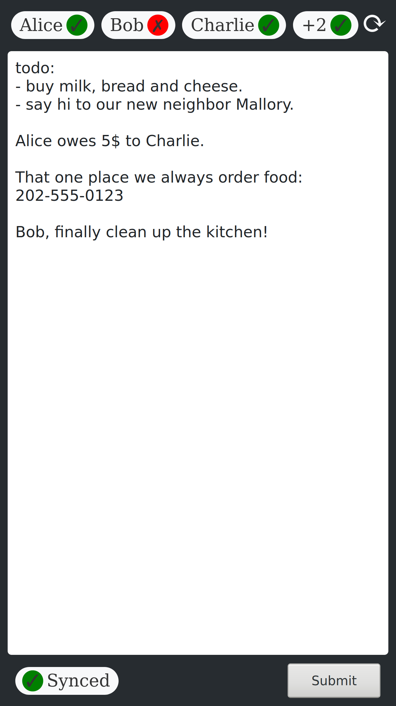

# FlatPad

FlatPad is a small tool that makes living with other people easier. See who is currently at home and share text on a digital pad.

## Features

* Know with a glance who is at home without checking for their shoes.
    * Works by checking your router for the MAC addresses of people's phones. (Currently only supports [AVM Fritz!Box](https://en.avm.de/products/fritzbox/))
    * Falls back to using `nmap` if the router check fails.
* Use the pad to share information.
    * Indicates whether the content is synced
    * Accessible to everyone in the network, no need for a messaging group.

## Installation

`pip3 install flatpad`

## Usage

`flatpad run [port]` (or `~/.local/bin/flatpad run` if pip's binaries are not in your PATH).
Now FlatPad is running at `http://localhost:8000` or the port you specified.

Add the MAC addresses of the people you want to display on top of the page to the devices.json. It is located in FlatPad's directory:
`flatpad directory`  
(e.g. `~/.local/lib/python3.8/site-packages/flatpad/devices.json`)

Simply follow the format of the default file. Names in the "People" segment will be green if at least one of their devices is in the network.  
All MACs not listed in this section will be summed up and are shown in an extra bubble.  
MACs in the "Ignored" section will not be counted towards this sum (e.g. your TV, a repeater or your toaster).  

In order to use the Fritz!Box feature, specify its ip and the password in the config.ini in the same directory as above (without quotes).

For the `nmap` fallback, make sure that you have `nmap` installed on your system and it is able to open raw sockets without root access.  
`sudo setcap cap_net_raw+eip /usr/bin/nmap`

Have fun!
